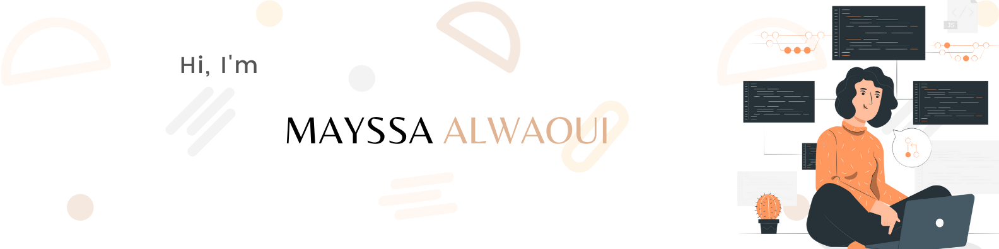

Hey there 👋

I’m Mayssa, a Computer Science graduate, Software Engineering student, creative coder and self-proclaimed UI/UX designer. My current mission is improving both my technical and soft skills.

💻 I'm currently working with Python along with learning Automation, Docker, Jenkins and other skills.

⚡ Fun fact: I got a dog to get over my fear of dogs and she's now part of the family.

📫 How to reach me: [alwaouimayssa@gmail.com](alwaouimayssa@gmail.com) 

<!--
**almayssa/almayssa** is a ✨ _special_ ✨ repository because its `README.md` (this file) appears on your GitHub profile.

Here are some ideas to get you started:

- 🔭 I’m currently working on ...
- 🌱 I’m currently learning ...
- 👯 I’m looking to collaborate on ...
- 🤔 I’m looking for help with ...
- 💬 Ask me about ...
- 📫 How to reach me: ...
- 😄 Pronouns: ...
- ⚡ Fun fact: ...
-->
